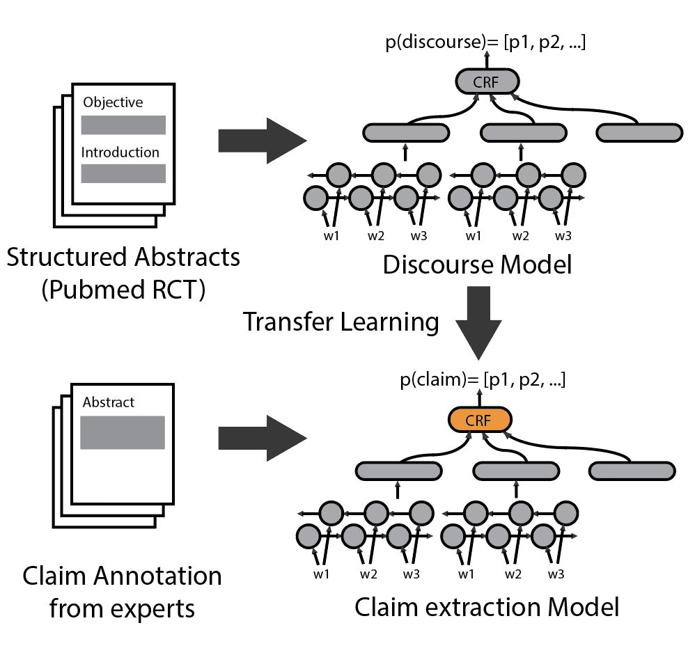
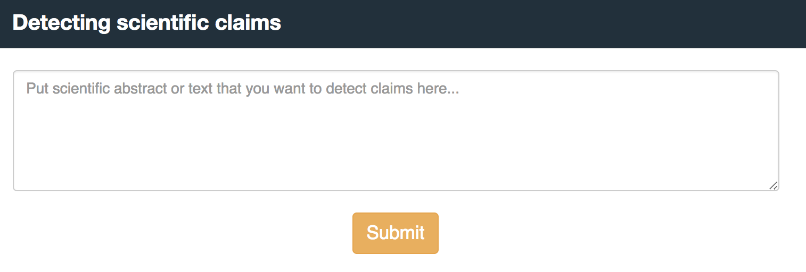
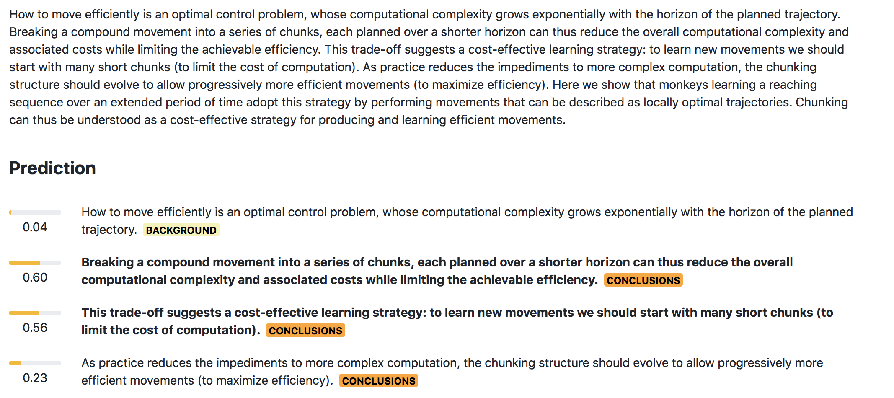

# Claim Extraction for Scientific Publications

Detecting claim from scientific publication using [discourse model](https://github.com/Franck-Dernoncourt/pubmed-rct) and transfer learning. 
Models are trained using [AllenNLP](https://github.com/allenai/allennlp) library.

## Installing as a package

You can install the package using PIP, which will help you use the `discourse` classes inside a module

```bash
pip install git+https://github.com/titipata/detecting-scientific-claim.git
```

you will be able to use them as

```python
import discourse
predictor = discourse.DiscourseCRFClassifierPredictor()
```

## Training discourse model

Running AllenNLP to train a discourse model using [PubmMedRCT dataset](https://github.com/Franck-Dernoncourt/pubmed-rct) as follows

```bash
allennlp train experiments/pubmed_rct.json -s output --include-package discourse
```

We point data location to Amazon S3 directly in `pubmed_rct.json`
so you do not need to download the data locally. Change `cuda_device` to `-1` in `pubmed_rct.json`
if you want to run on CPU. There are more experiments available in `experiments` folder.

**Note** that you have to remove `output` folder first before running.


## Predicting discourse

We trained the Bidirectional LSTM model on structured abstracts from Pubmed to predict
discourse probability (`RESULTS`, `METHODS`, `CONCLUSIONS`, `BACKGROUND`, `OBJECTIVE`)
of a given sentence. You can download trained model from Amazon S3

```bash
wget https://s3-us-west-2.amazonaws.com/pubmed-rct/model.tar.gz # or model_crf.tar.gz for pretrained model with CRF layer
```

and run web service for discourse prediction task as follow

```bash
bash web_service.sh
```

To test the train model with provided examples [`fixtures.json`](pubmed-rct/PubMed_200k_RCT/fixtures.json),
simply run the following to predict labels.

```bash
allennlp predict model.tar.gz \
    pubmed-rct/PubMed_200k_RCT/fixtures.json \
    --include-package discourse \
    --predictor discourse_predictor
```

or run the following for 

```
allennlp predict model_crf.tar.gz \
    pubmed-rct/PubMed_200k_RCT/fixtures_crf.json \
    --include-package discourse \
    --predictor discourse_crf_predictor
```

To evaluate discourse model, you can run the following command

```bash
allennlp evaluate model.tar.gz \
  https://s3-us-west-2.amazonaws.com/pubmed-rct/test.json \
  --include-package discourse
```


## Predicting claim (web service)

We use transfer learning with fine tuning to train claim extraction model 
from pre-trained discourse model. The schematic of the training can be seen below.

<p float="left">
  
</p>

You can run the demo web application to detect claims as follows

```bash
export FLASK_APP=main.py
flask run --host=0.0.0.0 # this will serve at port 5000
```

The interface will look something like this

<p float="left">
  
</p>

And output will look something like the following (highlight means claim,
  tag behind the sentence is discourse prediction)

<p float="left">
  
</p>


**Expertly annotated dataset** We release the dataset of annotated 1,500 abstracts containing 11,702 sentences (2,276 annotated as claim sentences) 
sampled from 110 biomedical journals. The final dataset are the majority vote from three experts. The annotations are hosted on Amazon S3 and 
can be found from these given [URLs](https://github.com/titipata/detecting-scientific-claim/blob/master/scripts/transfer_learning_crf.py#L48-L50).


## Requirements

- [Python 3.6](https://www.python.org/downloads/release/python-360/)
- [AllenNLP](https://github.com/allenai/allennlp) >= 0.6.1
- [spacy](https://github.com/explosion/spaCy)
- [fastText](https://github.com/facebookresearch/fastText)
- [Pubmed RCT](https://github.com/Franck-Dernoncourt/pubmed-rct) - dataset


## Citing the repository

You can cite our paper available on arXiv as

Achakulvisut, Titipat, Chandra Bhagavatula, Daniel Acuna, and Konrad Kording. _"Claim Extraction in Biomedical Publications using Deep Discourse Model and Transfer Learning."_ arXiv preprint arXiv:1907.00962 (2019).

or using BibTeX

```
@article{achakulvisut2019claim,
  title={Claim Extraction in Biomedical Publications using Deep Discourse Model and Transfer Learning},
  author={Achakulvisut, Titipat and Bhagavatula, Chandra and Acuna, Daniel and Kording, Konrad},
  journal={arXiv preprint arXiv:1907.00962},
  year={2019}
}
```

## Acknowledgement

This project is done at the [Allen Institute for Artificial Intelligence](https://allenai.org/)
and [Konrad Kording lab, University of Pennsylvania](http://kordinglab.com/)
